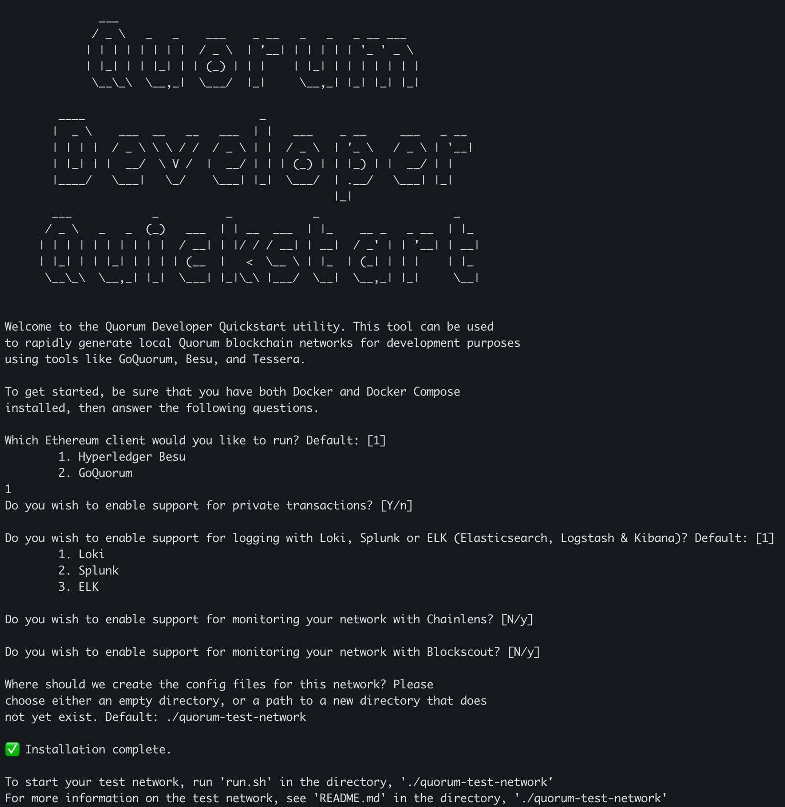
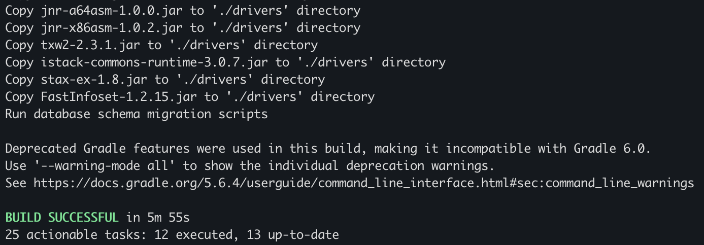

# ハンズオン

## はじめに

このリポジトリは [Hyperledger Labs Harmonia](https://github.com/hyperledger-labs/harmonia) で提供されている R3 の参照実装のアプリケーションをローカル環境でハンズオンするために作成されました． 既存の R3 の参照実装のままでは UT の実行はできますが，一部実装に不足箇所があり実際に Corda ノードを起動して動作を確認することができません．そこでローカル環境で Bootstrapper を使用して動作確認できるように，一部ソースコードを改変したものをここでは扱います．

## 環境準備

ハンズオン用アプリは以下の環境で動作確認してます．

| Software | version                      |
| -------- | ---------------------------- |
| Java     | Oracle JDK 8                 |
| node.js  | 16.19.0                      |
| npm      | 9.7.1                        |
| npx      | 9.7.1                        |
| Intellij | ~v2021.x.y Community Edition |
| Docker   | Docker Desktop 4.28.0        |
| OS       | macOS 14.2.1                 |

### **BESU テストネットワークセットアップ**

1. **quickstart のソース一式を取得します**

   次のコマンドでソース一式を取得します。

   以降、ガイドに沿ってオプションを選択します。

   ```
   npx quorum-dev-quickstart
   ```

   

   上記の画面が表示されます．

   今回は全てデフォルトの設定で問題ないため，全ての質問に ENTER キーを押してください．

   すると：

   1. ネットワーク：Hyperledger BESU
   2. private transaction 　あり
   3. ロギング：Loki
   4. Chainlens なし
   5. Blockscount なし
   6. ソースの保存先：`./quorum-test-network`

   となります．

   インストールが完了したらディレクトリに入って`run.sh`を実行します。

   上記の画面が表示されれば，BESU テストネットワークの記号が完了です．

2. **スマートコントラクトのデプロイ**

   続いて，アトミックスワップに必要なスマートコントラクトをデプロイしていきます．

   以下のコマンドを実行し，GitHub からソースをクローンしてきます．

   ```
   git clone https://github.com/sbir3japan/harmonia-hands-on.git
   ```

   ./harmonia-hands-on/evm に移動します．

   hardhat.config.js の network.besu.accounts にハードコーディングされている秘密鍵を，今回 BESU で使用する EOA の秘密鍵に書き換えます．

   ```
       besu: {
         url: "http://localhost:8545",
         accounts: [
           "0x8bbbb1b345af56b560a5b20bd4b0ed1cd8cc9958a16262bc75118453cb546df7",
           "0x4762e04d10832808a0aebdaa79c12de54afbe006bfffd228b3abcc494fe986f9",
           "0x61dced5af778942996880120b303fc11ee28cc8e5036d2fdff619b5675ded3f0",
         ],
       },
   ```

   以下のコマンドを実行し，コントラクトをデプロイします．

   ```
   npx hardhat run deploy.js --network besu
   ```

   デプロイに成功すると以下の文字列が出力されます:

   USD Tethered (USD) Token deployed to: 0x00fFD3548725459255f1e78A61A07f1539Db0271（デプロイ時に割り当てられるアドレス．環境によって異なります．）

   GBP Tethered (GBP) Token deployed to: 0x899CE22c2142f60ecA9574c3781A076136D46373（デプロイ時に割り当てられるアドレス．環境によって異なります．）

   SwapVault deployed to: 0x695Baaf717370fcBb42aB45CD83C531C27D79eF1（デプロイ時に割り当てられるアドレス．環境によって異なります．）

   これらのアドレスは Corda 側で Flow を実行する際に必要となりますので，メモしておいてください．

### **Corda テストネットワークのセットアップ**

1. Cordapp のビルド

   harmonia-hands-on/corda に移動します．

   以下のコマンドを実行します．

   ```
   ./gradlew deployNodes
   ```

   ビルドに成功すると以下の画面が表示されます．

   

   また corda/build/nodes 配下に Alice, Bob, Charlie, Notary

   **テストネットワークの起動**

   - Alice, Bob, Charlie, Notary ディレクトリが corda/build/nodes 配下に作成されるので，以下のコマンド実行し，DB migration を行います．

     ```
     java -jar corda.jar run-migration-scripts --core-schemas --app-schemas

     ```

   - migration が終了したら以下のコマンドを実行し，Corda ノードを起動します．

     ```
     java -jar corda.jar

     ```

   - Alice, Bob, Charlie ノードでそれぞれ以下のコマンドを実行し，EVM ネットワークとの接続設定をします．
     - Alice
     ```
     start com.r3.corda.evminterop.workflows.demo.DemoNetworkSetUpFlow privateKey: "0x8bbbb1b345af56b560a5b20bd4b0ed1cd8cc9958a16262bc75118453cb546df7", protocolAddress: "0x695Baaf717370fcBb42aB45CD83C531C27D79eF1", evmDeployerAddress: "0x0fBDc686b912d7722dc86510934589E0AAf3b55A"
     ```
     - Bob
     ```
     start com.r3.corda.evminterop.workflows.demo.DemoNetworkSetUpFlow privateKey: "0x4762e04d10832808a0aebdaa79c12de54afbe006bfffd228b3abcc494fe986f9", protocolAddress: "0x695Baaf717370fcBb42aB45CD83C531C27D79eF1", evmDeployerAddress: "0x0fBDc686b912d7722dc86510934589E0AAf3b55A"
     ```
     - Charlie
     ```
     start com.r3.corda.evminterop.workflows.demo.DemoNetworkSetUpFlow privateKey: "0xe6181caaffff94a09d7e332fc8da9884d99902c7874eb74354bdcadf411929f1", protocolAddress: "0x695Baaf717370fcBb42aB45CD83C531C27D79eF1", evmDeployerAddress: "0x0fBDc686b912d7722dc86510934589E0AAf3b55A"
     ```

## 取引開始

- Bob@Corda で RWA トークンを発行する
  ```
  start com.r3.corda.evminterop.workflows.IssueGenericAssetFlow assetName: "RWA"
  ```
- Bob@Corda で Draft TX を作成し，Alice@Corda に共有する
  ```
  start com.r3.corda.evminterop.workflows.demo.DemoBuildAndProposeDraftTransactionFlow transactionId: "{txid}", outputIndex: 0, buyerAddress: "0xf0E2Db6C8dC6c681bB5D6aD121A107f300e9B2b5", buyerCordaName: "Alice", sellerAddress: "0xcA843569e3427144cEad5e4d5999a3D0cCF92B8e", signerAddress: "0xed9d02e382b34818e88B88a309c7fe71E65f419d", signerCordaName: "Charlie", tokenAddress: "0x00fFD3548725459255f1e78A61A07f1539Db0271", protocolAddress: "0x695Baaf717370fcBb42aB45CD83C531C27D79eF1", amount: 100
  ```
- Alice＠Corda はスワップコントラクトにデジタル通貨をコミットする
  ```
  start com.r3.corda.evminterop.workflows.swap.CommitWithTokenFlow transactionId: "{txid}", tokenAddress: "0x00fFD3548725459255f1e78A61A07f1539Db0271", amount: 100, recipient: "0xcA843569e3427144cEad5e4d5999a3D0cCF92B8e", signaturesThreshold: 1, signers: ["0xed9d02e382b34818e88B88a309c7fe71E65f419d"]
  ```
- Bob@EVM はデジタル通貨のコミットが確認できたら，Draft TX に署名する．ここで Notary の署名も入る．
  ```
  start com.r3.corda.evminterop.workflows.demo.DemoSignDraftTransaction transactionId: "{txid}"
  ```
- Bob@Corda はバリデータに署名依頼する．
  ```
  start com.r3.corda.evminterop.workflows.demo.NotarizationSignaturesCollectorFlow$CollectNotarizationSignaturesFlow transactionId: "{txid}", blocking: true
  ```
- Bob@Corda はスワップコントラクトコミットされたトークンを引き出す
  ```
  start com.r3.corda.evminterop.workflows.demo.DemoClaimCommitment transactionId: "{txid}"
  ```
- Alice@Corda は EVM における支払いの証明を作成する
  ```
  start com.r3.corda.evminterop.workflows.demo.BlockSignaturesCollectorFlow$CollectBlockSignaturesFlow transactionId: "{txid}", blockNumber: {block_number}, blocking: true
  ```
- Alice@Corda は上記で作成した支払い証明を以って，デジタルアセットを引き出す
  ```
  start com.r3.corda.evminterop.workflows.demo.DemoUnlockAssetFlow transactionId: "{txid}", blockNumber: {block_number}, transactionIndex: 0
  ```

以上の操作を行うことで Corda 上のデジタルアセットの Bob→Alice への移転，EVM 上のデジタル通貨の Alice→Bob への支払いがアトミックに完了しているはずです．

## 取引結果の確認

実際に資産及び通貨が移動しているかは以下のコマンドで確認できます．

- Corda デジタルアセットの確認（Alice ノードで実行）

```
run vaultQuery contractStateType: com.r3.corda.evminterop.workflows.GenericAssetState
```

- Alice@EVM のデジタル通貨の残高確認

```
curl -X POST http://localhost:8545 \
-H "Content-Type: application/json" \
-d '{
  "jsonrpc":"2.0",
  "method":"eth_call",
  "params":[
    {
      "to": "0x00fFD3548725459255f1e78A61A07f1539Db0271",
      "data": "70a08231000000000000000000000000f0E2Db6C8dC6c681bB5D6aD121A107f300e9B2b5"
    },
    "latest"
  ],
  "id":1
}'
```

- Bob@EVM のデジタル通貨の残高確認

```
curl -X POST http://localhost:8545 \
-H "Content-Type: application/json" \
-d '{
  "jsonrpc":"2.0",
  "method":"eth_call",
  "params":[
    {
      "to": "0x00fFD3548725459255f1e78A61A07f1539Db0271",
      "data": "70a08231000000000000000000000000cA843569e3427144cEad5e4d5999a3D0cCF92B8e"
    },
    "latest"
  ],
  "id":1
}'
```

お疲れ様でした．
